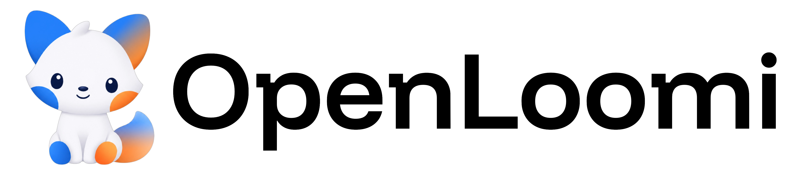
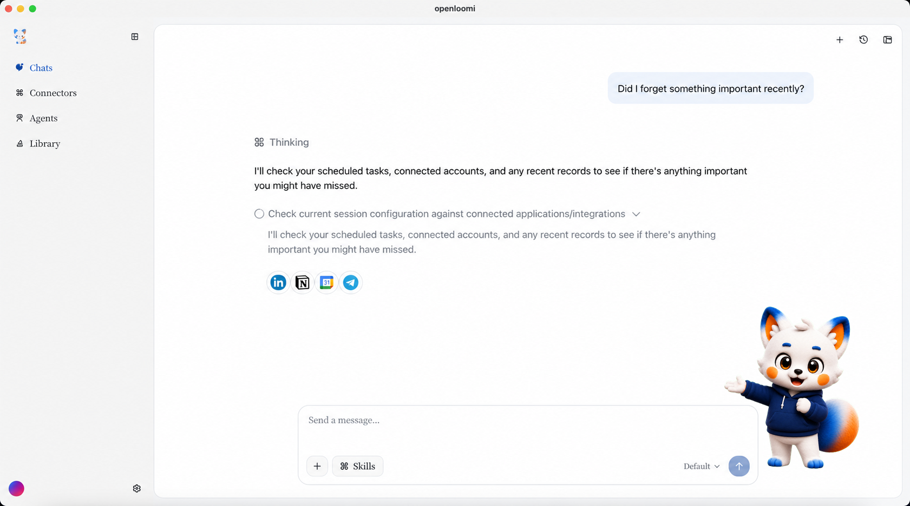

<div align="center">
<picture>
  <source media="(prefers-color-scheme: dark)" srcset="apps/web/public/images/logo-text-dark.png">
  
</picture>

**いつもあなたを覚えているAI。**

<p align="center">
<a href="./README.md">English</a> | <a href="./README-zh.md">简体中文</a> | <a href="./README-ja.md">日本語</a>
</p>

[](https://openloomi.ai)
[](https://www.apache.org/licenses/LICENSE-2.0)
[](https://discord.com/invite/xkJaJyWcsv)
[](https://x.com/AlloomiAI)
[](https://github.com/melandlabs/openloomi/releases)

</div>

---

## OpenLoomiとは？

OpenLoomiは、デスクトップ上で動作するオープンソースのAIワークスペースです。すでに使っているツール（メッセージアプリ、メール、カレンダー、ドキュメント、プロジェクト管理ツールなど）と連携し、あなたの人間関係、プロジェクト、意思決定の**ホリスティック・コンテキスト・グラフ**を構築します。

<p align="center">
  
</p>

## 機能

|     | 機能                                                                                   | 内容                                                                                                                                                                                                                                                                                                                                                                                                                                                                                                                                                                              |
| --- | -------------------------------------------------------------------------------------- | --------------------------------------------------------------------------------------------------------------------------------------------------------------------------------------------------------------------------------------------------------------------------------------------------------------------------------------------------------------------------------------------------------------------------------------------------------------------------------------------------------------------------------------------------------------------------------- |
| 🐾  | **[注意エージェント](https://openloomi.ai/docs/attention-agent)**                      | デスクトップ常駐の相棒 Loomi が、9 時の ToDo、18 時の振り返り、未返信のリマインダーなど、決裁済みのリマインダーを小さなバブルでお知らせ。集中を妨げません。                                                                                                                                                                                                                                                                                                                                                                                                                       |
| 🧠  | **[ホリスティック・コンテキスト・グラフ](https://openloomi.ai/docs/memory)**           | 短期 → 中期 → 長期の記憶が自律的に成長します。可視化・監査が可能で、何カ月にもわたってあなたの人間関係、プロジェクト、意思決定を常に記憶し続けます                                                                                                                                                                                                                                                                                                                                                                                                                                |
| 🔌  | **[プラットフォームコネクタ](https://openloomi.ai/docs/connectors)**                   | **[自動フェッチ](https://openloomi.ai/docs/what-is-openloomi#a-complete-intelligence-loop-from-perception-to-action)** バックグラウンド同期ループがコミット、課題、メール、ドキュメントを能動的に取得しグラフに保存。**[メッセージングアプリ](https://openloomi.ai/docs/messaging-apps)** — Telegram、WhatsApp、iMessage、QQ、拉翅/Feishu — 既存の会話内で直接AIとチャット可能。全リスト：Telegram、WhatsApp、WeChat、DingTalk、Feishu、Gmail、Google Calendar、Outlook、Google Docs、X/Twitter、Instagram、LinkedIn、Facebook Messenger、Jira、HubSpot、Asana、iMessage、QQ、RSS |
| ⏰  | **[プロアクティブタスク](https://openloomi.ai/docs/automation)**                       | 繰り返しの作業——日次ダイジェスト、週次レポート、リマインダー——をデスクトップで自動実行。                                                                                                                                                                                                                                                                                                                                                                                                                                                                                          |
| 🖥️  | **[セキュリティと使いやすさ](https://openloomi.ai/docs/privacy-security)**             | Windows、macOS、Linux向けのネイティブデスクトップアプリ。**すぐに使えて**、セットアップは数分、設定で苦労することはありません。IndexedDB + SQLiteによるローカルファースト保存、AES-256暗号化、データが端末外に出ることはなく、監査可能なアクセスログを備えています                                                                                                                                                                                                                                                                                                                |
| 🔗  | **[オープンソース化されたスキル](https://openloomi.ai/docs/skills)**                   | OpenLoomi Skillsはオープンソースで、あらゆるエージェントに組み込めます。Claude Code、Codex、OpenClaw、Hermesなどに対応しています。                                                                                                                                                                                                                                                                                                                                                                                                                                                |
| 🛠️  | **[任意のエージェントランタイム](https://openloomi.ai/docs/reference/agent-runtimes)** | 基盤エージェントを自由に選択 — Claude（デフォルト）、Codex、OpenCode、Hermes、OpenClaw。                                                                                                                                                                                                                                                                                                                                                                                                                                                                                          |
| 🧩  | **[Codex と Claude プラグイン](https://openloomi.ai/docs/plugins)**                    | OpenLoomi のコンテキスト、メモリ、コネクタ、注意エージェントなどの機能を Claude や Codex に持ち込み。                                                                                                                                                                                                                                                                                                                                                                                                                                                                             |

<p align="center">
  
</p>

## クイックスタート

**直接ダウンロード**（エンドユーザー向け）:

| macOS Apple Silicon                                                                                        | macOS Intel                                                                                              | Linux AMD64                                                                                                                                                                                                         | Linux ARM64                                                                                                                                                                                                             | Windows                                                                                                    |
| ---------------------------------------------------------------------------------------------------------- | -------------------------------------------------------------------------------------------------------- | ------------------------------------------------------------------------------------------------------------------------------------------------------------------------------------------------------------------- | ----------------------------------------------------------------------------------------------------------------------------------------------------------------------------------------------------------------------- | ---------------------------------------------------------------------------------------------------------- |
| [.dmg](https://github.com/melandlabs/openloomi/releases/download/v0.7.9/openloomi_0.7.9_macOS_aarch64.dmg) | [.dmg](https://github.com/melandlabs/openloomi/releases/download/v0.7.9/openloomi_0.7.9_macOS_amd64.dmg) | [.deb](https://github.com/melandlabs/openloomi/releases/download/v0.7.9/openloomi_0.7.9_linux_amd64.deb) / [.rpm](https://github.com/melandlabs/openloomi/releases/download/v0.7.9/openloomi_0.7.9_linux_amd64.rpm) | [.deb](https://github.com/melandlabs/openloomi/releases/download/v0.7.9/openloomi_0.7.9_linux_aarch64.deb) / [.rpm](https://github.com/melandlabs/openloomi/releases/download/v0.7.9/openloomi_0.7.9_linux_aarch64.rpm) | [.exe](https://github.com/melandlabs/openloomi/releases/download/v0.7.9/openloomi_0.7.9_windows_amd64.exe) |

詳細なドキュメントは[こちら](https://openloomi.ai/docs)で確認できます。

**ローカルで開発**（開発者向け）:

```bash
git clone https://github.com/melandlabs/openloomi.git
cd openloomi

pnpm install
pnpm tauri:dev
```

Node.js 22以上、pnpm 9以上、Rust 1.75以上が必要です。Windows では Visual Studio Build Tools と C++ ワークロードが必要です。プラットフォーム固有のセットアップ要件の詳細については、[CONTRIBUTING.md](./CONTRIBUTING.md) を参照してください。

## 他のとは違う点

| 比較対象               | OpenLoomi が追加するもの                                                                                           |
| ---------------------- | ------------------------------------------------------------------------------------------------------------------ |
| Claude Cowork 型 Agent | オープンソースでローカルファーストのAI同僚とワークスペース。ソース証拠と承認を備えている                           |
| Codex / Claude Code    | リポジトリを超えたワークスペースコンテキスト：人物、製品の意思決定、リリースコンテキスト、課題、フォローアップ     |
| OpenClaw / Hermes      | アクションの前後：なぜ重要なのか、どのソースが使われたのか、何が変わったのか、何が残っているのか                   |
| RAG / ナレッジベース   | ワーク状態であり単なるドキュメント検索ではない：何が変わったのか、何がまだ有効なのか、次のアクションに何影響するか |

## アプリのスクリーンショット

<table>
<tr>
<td></td>
<td></td>
</tr>
<tr>
<td></td>
<td></td>
</tr>
<tr>
<td></td>
<td></td>
</tr>
</table>

## フィードバック

これは初期段階のソフトウェアです。実際にインストールしてツールを連携し、何が動かないかを教えてくれる方を募集しています。

- [GitHub Issues](https://github.com/melandlabs/openloomi/issues) — バグ、インストールの問題、機能リクエスト
- [Discord](https://discord.com/invite/xkJaJyWcsv) — ディスカッション、質問、サポート
- [メール](mailto:developer@alloomi.ai) — その他なんでも

## コントリビュート

[CONTRIBUTING.md](./CONTRIBUTING.md)をご覧ください。[`good first issue`](https://github.com/melandlabs/openloomi/labels/good%20first%20issue)ラベルを探してみてください。

## ライセンス

[Apache 2.0](./LICENSE)
