# OpenLoomi × Claude Code — End-to-End Tour Guide

This is the canonical, end-to-end walkthrough for the OpenLoomi Claude Code
plugin. Every step is a single Claude Code turn or a single desktop-app
interaction; every screenshot is from a real run.

The full path: **install the plugin → land in a ready Claude Code session →
see the Loomi Pet pop on the desktop → flip the pet theme → call
`/openloomi:status` for the canonical JSON → opt into the Pet-mirror +
Stop-archive hooks → connect external apps via Composio → and finally watch
OpenLoomi's Loop surface decision cards in the desktop app** — all driven by
slash commands you typed in Claude Code.

If you only want the commands, the [README](./README.md) is enough. This
document is for when you want to see _what the system actually looks like_
in motion.

---

## 1. Ask Claude Code to install the plugin

```text
> Install the plugin and setup https://github.com/melandlabs/openloomi/tree/main/plugins/claude
```

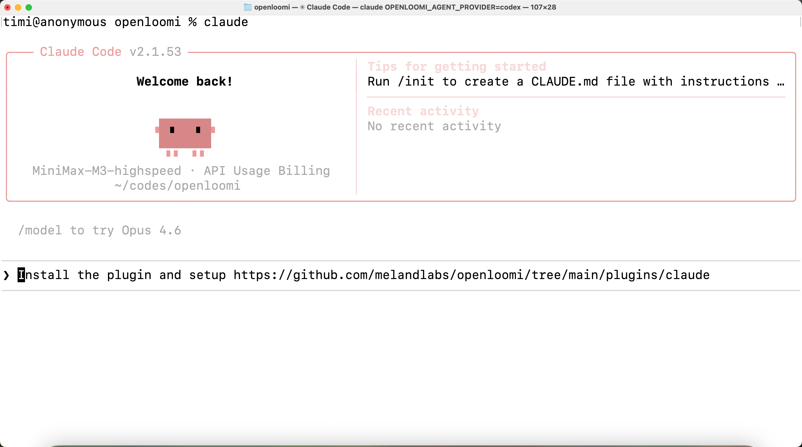

## 2. Add the marketplace

```text
> /plugin marketplace add melandlabs/openloomi
```

Claude Code prompts for a source. Enter `melandlabs/openloomi` — it refreshes
the marketplace cache and you now see the `openloomi` plugin in the
marketplace list.

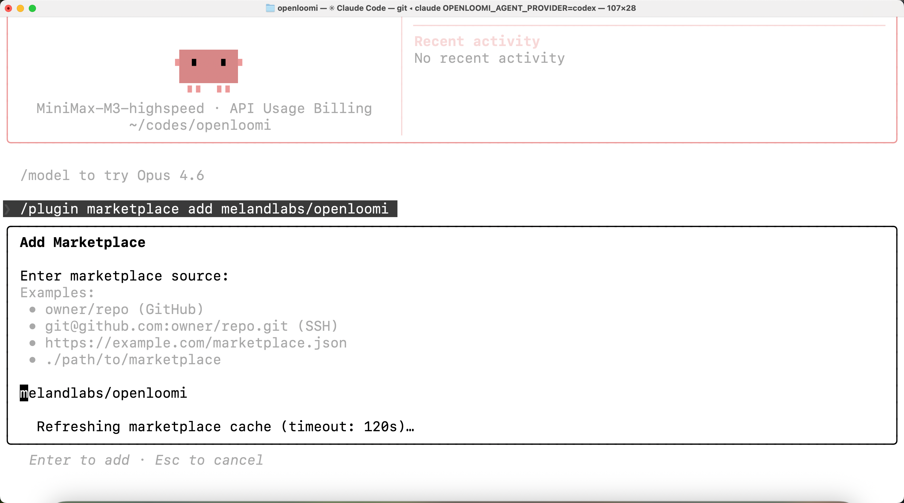

## 3. Launch Claude Code pointing at the local plugin

For plugin contributors (or anyone running from a checkout):

```text
% claude --plugin-dir plugins/claude
```

The plugin is now loaded into the session; you can confirm by typing
`/openloomi:` and seeing the autocomplete.

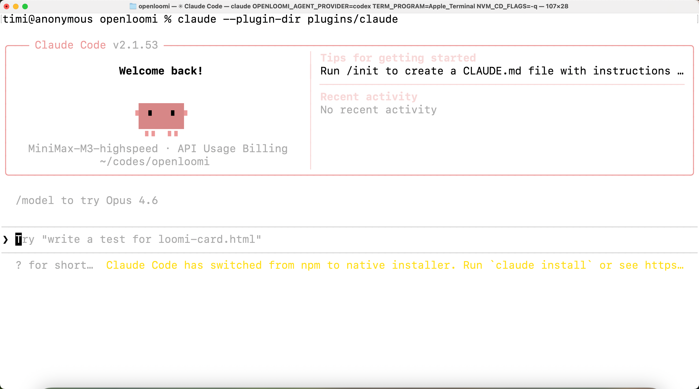

## 4. Discover the slash commands

Type `/openloomi:` — Claude Code surfaces the full namespace:

- `/openloomi:setup` — one-time install → launch → ready
- `/openloomi:status` — stable JSON status
- `/openloomi:pet` — set the Loomi Pet state
- `/openloomi:help` — list all commands
- `/openloomi:hooks` — install / uninstall / inspect hooks
- `/openloomi:connect` — walk through composio + screen memory

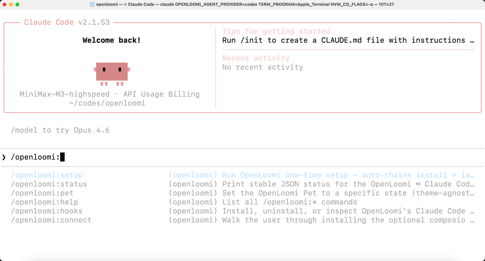

## 5. Run `/openloomi:setup` — readiness table + fox Pet appears

The wizard auto-chains install → launch → wait API → guest login. When it
finishes, the bridge prints a small readiness table on the **left**, and the
Loomi Pet pops onto your desktop in the **fox** theme on the **right** with
a `Loomi is on watch` badge.

The pet is the file-watcher-driven widget — it doesn't talk to the bridge; it
watches `~/.openloomi/pet-config.json` and the `assets/{fox,capybara}/`
folders.

| Item               | Status     |
| ------------------ | ---------- |
| Guest login        | Successful |
| Runtime mode       | packaged   |
| Version            | 0.8.1      |
| Local API          | Reachable  |
| AI provider        | Configured |
| Execution provider | Ready      |
| Desktop process    | Running    |
| Final status       | **READY**  |

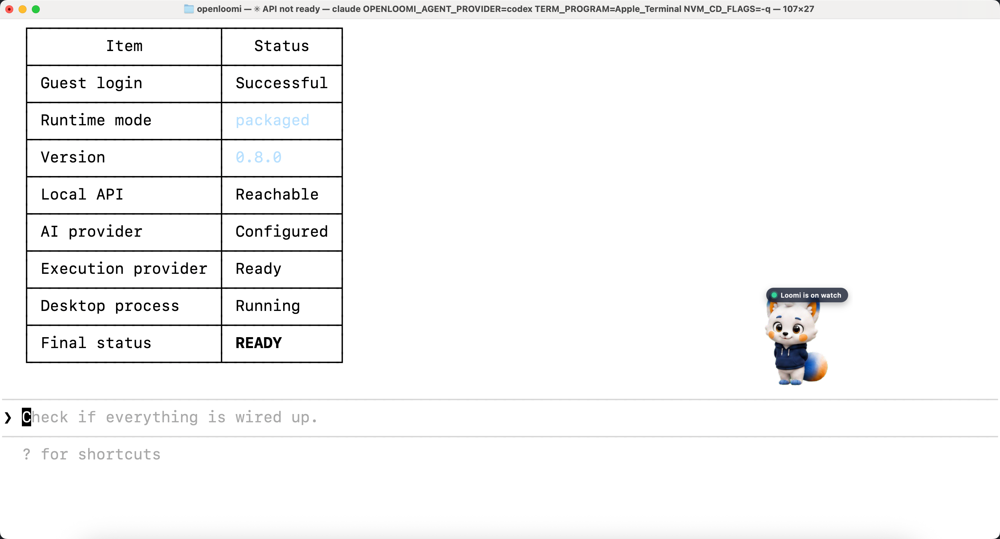

## 6. Right-click the Pet to open the context menu

The pet's context menu exposes **Open Loomi / Settings / THEME (Fox ✓,
Capybara) / Quit**. The theme switch is hot-reload — the file watcher picks
up `activeTheme` in `pet-config.json` within ~250 ms, and the bridge never
writes these files.

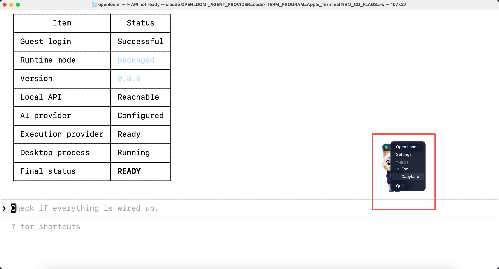

## 7. Pick **Capybara** — the theme hot-reloads immediately

The pet re-skins in place. Same 9-state vocabulary (`happy` / `idle` /
`juggling` / `needsinput` / `presenting` / `sleeping` / `sweeping` /
`thinking` / `working`) — only the artwork changes.

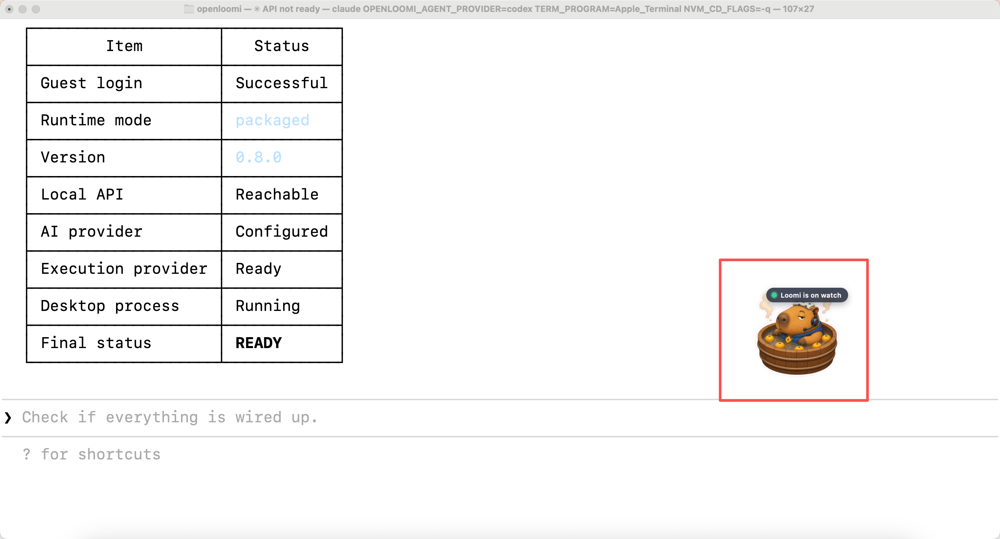

### 7b. Manually override the Pet state with `/openloomi:pet`

The hot-reload pet also accepts manual overrides from Claude Code. Type
`/openloomi:pet <state>` and the bridge writes the new state to
`~/.openloomi/pet/runtime_state.json`; the file watcher picks it up and the
sprite swaps within ~250 ms. Useful for "task done" beats where you want the
pet to flip to `happy` between turns.

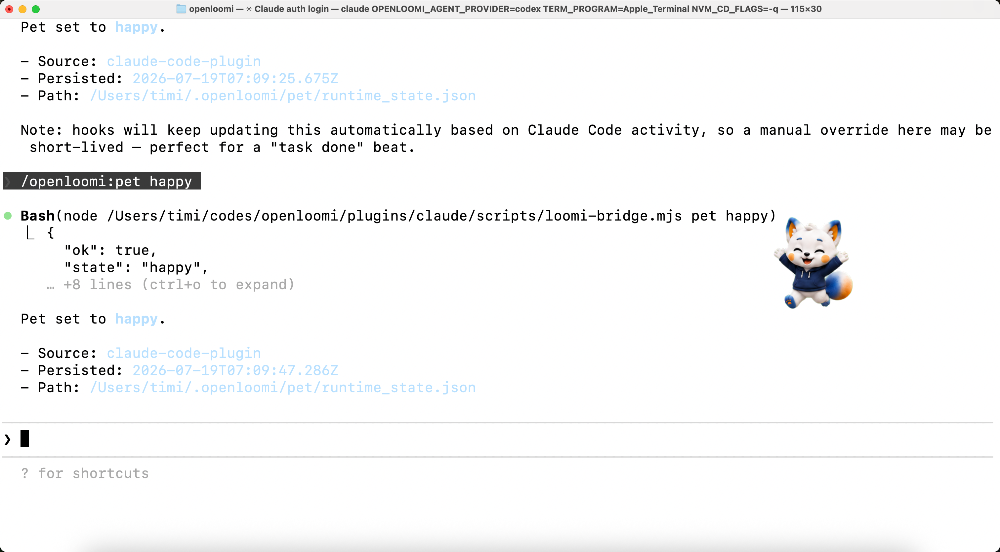

## 8. `/openloomi:status` returns the canonical JSON

For any triage / bug report, paste the JSON output verbatim. The shape is
stable: `mode / installed / version / tokenPresent / aiProviderConfigured /
nativeRuntime / apiReachable / hooksInstalled / ready / nextAction / reason /
source`.

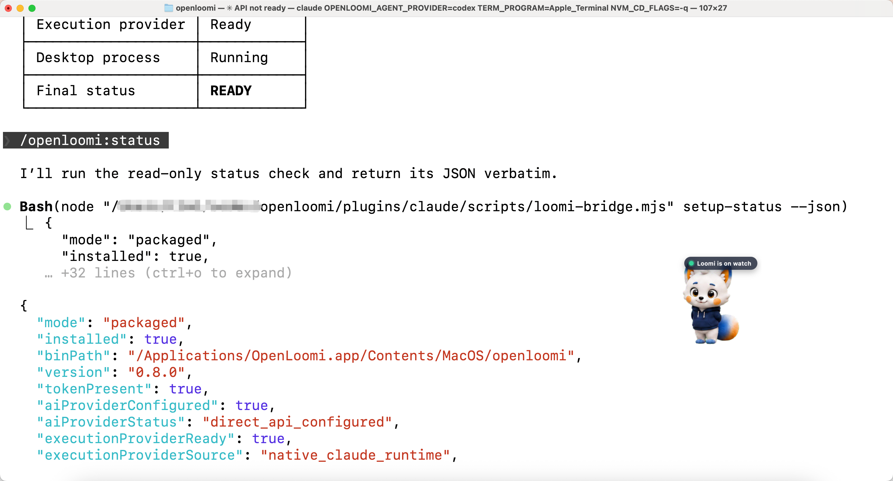

## 9. Opt into the Pet mirror + Stop archive

```text
> /openloomi:hooks
```

The command accepts `install | uninstall | status`. After install, the bridge
writes a marked block (`_openloomi_plugin`, keyed
`__openloomi_claude_plugin_hooks__`) into `~/.claude/settings.json` —
merge-no-overwrite, atomic, idempotent.

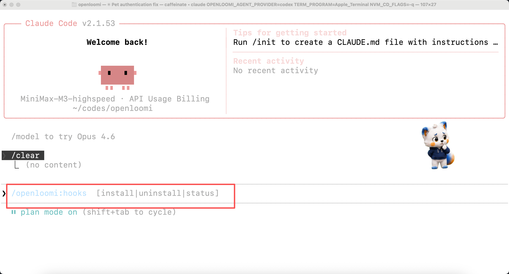

## 10. Hooks status — confirm install

```text
> /openloomi:hooks status
```

You should see:

- `installed: true`
- Settings path: `~/.claude/settings.json`
- Marker: `_openloomi_plugin`
- Schema: `per-event`
- Legacy block key: `__openloomi_claude_plugin_hooks__`

The Stop hook now reads your session transcript (last 6 turns, ≤6 KB) and
POSTs a `note` to `/api/insights` under the `claude-code` group. It always
exits 0.

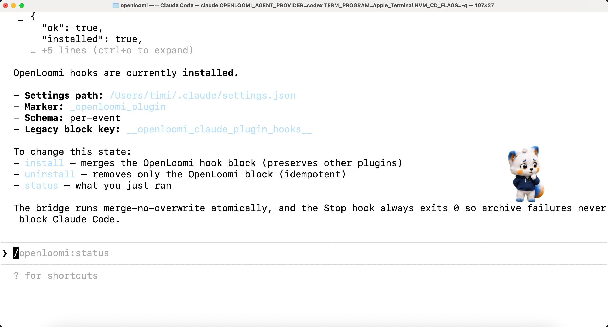

## 11. `/openloomi:connect` — three independent y/N choices

The wizard walks you through three independent questions: install the
`composio` skill, enable Screen Memory (`Preferences → Chronicle → Screen
Memory` in the desktop app), and connect a messaging connector
(`openloomi-connectors` skill — native 7 platforms; or composio for the
broader 1000+).

The screenshot below shows the connector step in the middle of the wizard.

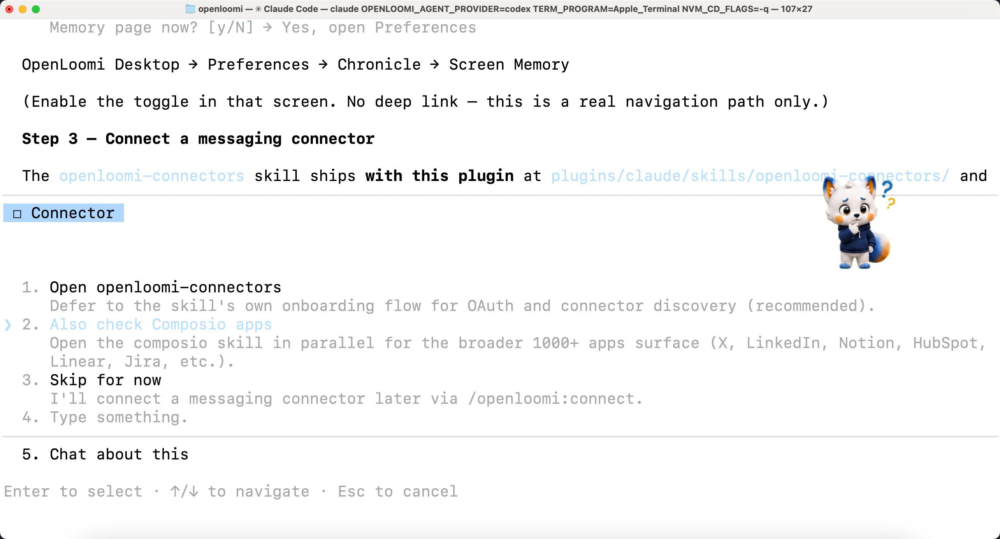

## 12. After Composio connects — 6 active apps

The next Claude Code turn can list what the user is actually wired up to. In
this run: Gmail, Google Calendar, Google Drive, GitHub, Linear, Slack — all
through Composio, with the workspace org and test user echoed back.

```text
Connected via Composio (6 active): Gmail, Google Calendar, Google Drive, GitHub, Linear, Slack
Org: timi_workspace · Test user: pg-test-…
```

From this point on, Claude Code is a thin UI on top of OpenLoomi. Anything
that happens in your connected apps — emails, PRs, calendar RSVPs, Linear
issues, Slack messages — gets pulled into OpenLoomi's memory and (if you opt
in) into its proactive Loop.

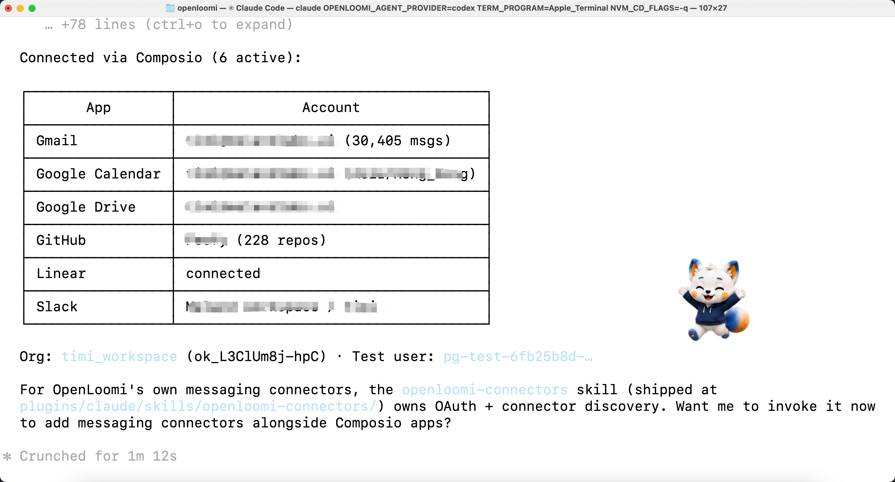

## 13. `/openloomi:memory` — see what's already in your local memory

```text
> /openloomi:memory
```

The command searches the local memory + knowledge base + insights and returns
a digest of what OpenLoomi already knows. In this run, the digest includes:

- A **"From Loomi" callout** at the top: "Sarah's signature says 'Head of
  Product' — memory still says PM" — the same drift that the Loop is
  about to surface as a `CONTACT_UPDATE` card.
- A **"Last 7 days (50 insights total)" table** with columns `# / Time
(UTC) / Type / Importance / Title` — auto-captured Claude Code session
  snapshots, Screen Memory captures, and the occasional archive note.
- **Notes** at the bottom explaining the mix (e.g. "duplicated sessions —
  two ingestion channels writing the same session", "two oldest sessions
  reference loop tick / Loomi card / 继续切 decision — carry-over from
  prior work before today's `/openloomi:setup` finished wiring up").

This is the read-only doorway into OpenLoomi's local memory. For a deeper
search, pass a query: `/openloomi:memory <query>`.

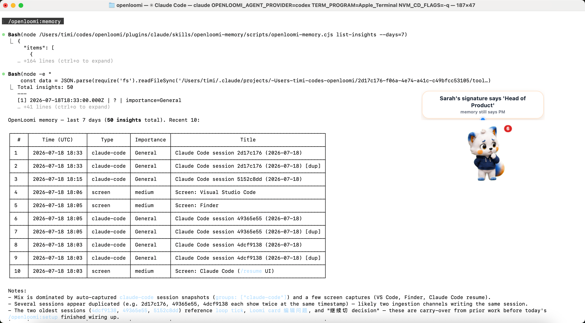

### 13b. Write to memory from Claude Code with `add-memory`

Reading is half the story — you can also write. From any Claude Code turn,
invoke `openloomi-memory add-memory "<text>" --file=<path>` and the entry
lands in `~/.openloomi/data/memory/<path>`. Below, "My boss is Tom." is saved
to `people/boss.md` and immediately searchable via `search-memory "boss"` or
`search-all "boss tom"`.

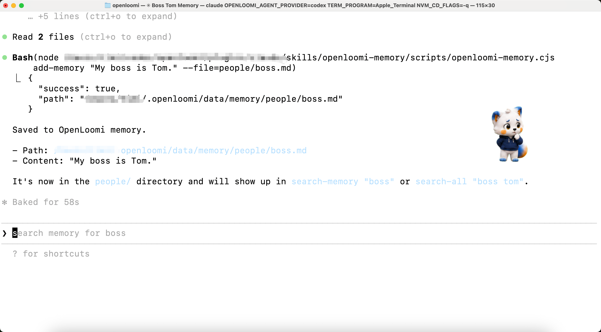

## 14. `/openloomi:loop` — see the Loop dashboard snapshot

```text
> /openloomi:loop
```

The command hits `GET /api/loop/state` and returns the Loop dashboard:

- **Header**: `enabled: true`, last tick timestamp.
- **Counts**: pending decisions, done, dismissed, signals seen (with
  unsupported count).
- **Connector health**: per-connector status (`needs_setup` /
  `local-only` / linked) for every platform the Loop can pull from.
- **Prefs in effect**: tick frequency, brief time, wrap time, quiet-when-
  empty, desktop notifications, promotion/no-reply skip, narrative mode.
- **Notes**: actionable observations — e.g. "all 5 Composio-backed
  connectors share one failure: the local Composio surface isn't
  reachable. Loop can't pull signals or generate decisions from
  Gmail/Calendar/GitHub/Slack/Linear until `/openloomi:connect` walks the
  Composio install."

This is purely a dashboard snapshot — the Loop never takes destructive
actions from this command. For actions, the Loop pops cards in the
desktop app (see step 15) and you decide there.

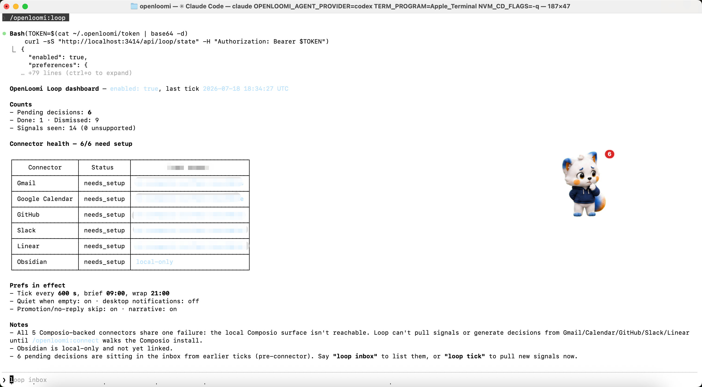

## 15. The Loop surfaces decision cards in OpenLoomi Desktop

This is what the system looks like when it's actually doing its job.
OpenLoomi's **Loop** is the proactive execution brain — it watches your
connected signals, classifies them into one of the decision types, and pops
a card into the desktop app with the `From Loomi` reasoning trace and the
action buttons you can hit.

Each card has the same shape: a `Signal` + `Type` + `Received` + `Confidence`
row at the top, the `From Loomi` explanation next, the `Reason 1 / Reason 2`
evidence trace, and the action buttons at the bottom.

| Decision type           | What it does                                | Example                                                                                |
| ----------------------- | ------------------------------------------- | -------------------------------------------------------------------------------------- |
| `RSVP`                  | Reply Yes / No to a calendar invitation     | "Reverb Q3 review — Wed 10:00 PT, organizer Sarah, conflicts with standup"             |
| `IM_REPLY`              | Draft a reply to a known contact            | "Alice is bumping the Q3 deck timeline — Thursday is close, she wants it locked today" |
| `EMAIL_REPLY`           | Pre-draft an outbound email                 | "Sarah needs the Q3 OKR draft status by Friday to align with finance"                  |
| `LINEAR_REVIEW`         | Triage a Linear issue assigned to you       | "LIN-1234 (pet bubble drag-and-drop) is in In Review with you assigned"                |
| `REQUIREMENT_SYNTHESIS` | Cluster PRs/issues into a requirements doc  | "14 PRs/issues tagged loop/v0.9 — needs a single requirements doc"                     |
| `RELEASE_PLAN`          | Draft a release plan from merged PRs        | "12 PRs merged since v0.8.1 — time to draft the v0.8.2 release plan"                   |
| `CONTACT_UPDATE`        | Update a contact record when memory drifts  | "Sarah's signature says 'Head of Product' — memory still says PM"                      |
| `DOC_UPDATE`            | Refresh a stale doc for the next version    | "docs/getting-started.md is stale (42 days, pre-v0.8.1)"                               |
| `REVIEW_PR`             | Surface a PR waiting on your review         | "PR #220 (lifestyle image prompts) is waiting on your review"                          |
| `DEADLINE_REMINDER`     | Surface an upcoming due date                | "v0.8.2 release plan due Friday — 3 PRs blocking the cut"                              |
| `TODO`                  | Add a follow-up to your todo list           | "Bug: historical self-owned calendar events surface as fake RSVP decisions"            |
| `DIGEST` (QUIET)        | Consolidate a flood of low-priority signals | "8 GitHub notifications — none urgent individually, but here's the consolidated view"  |

A few of the cards in detail:

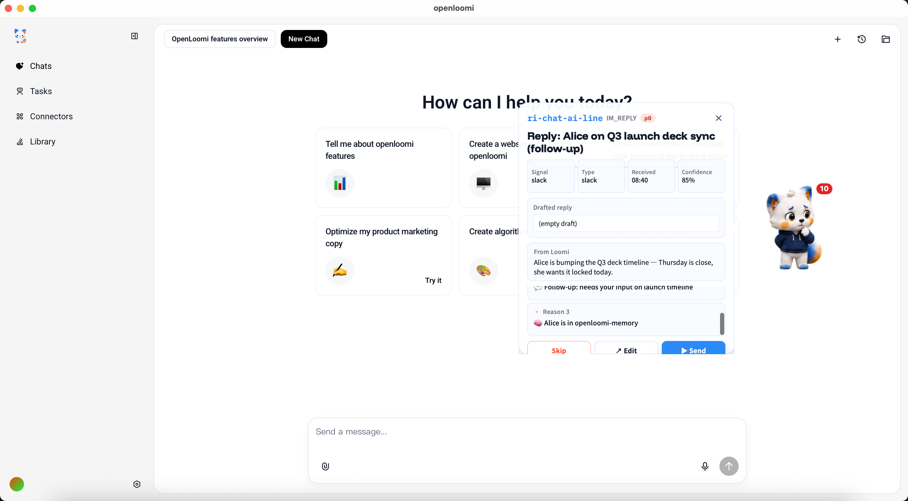

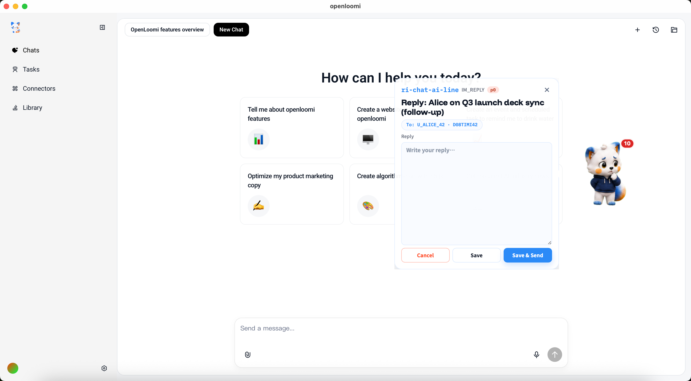

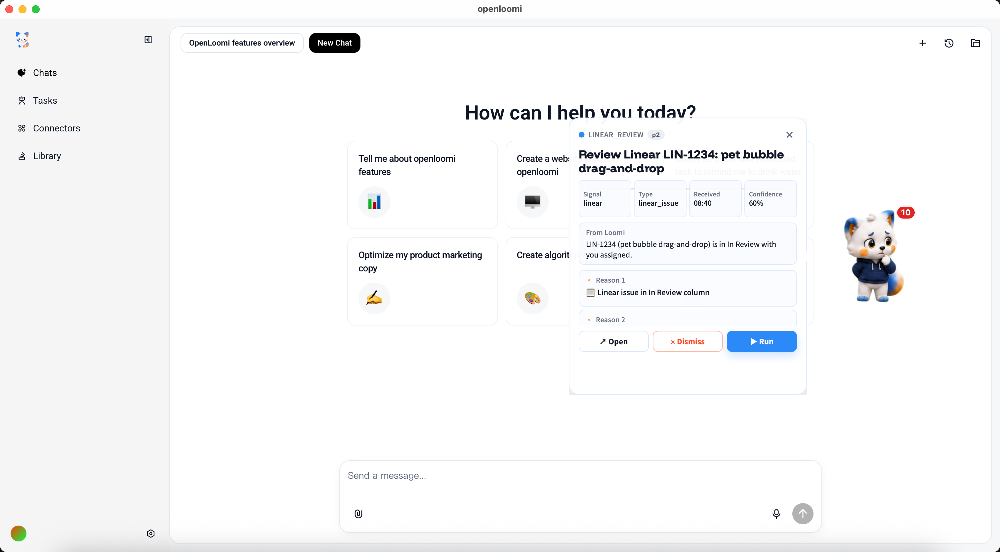

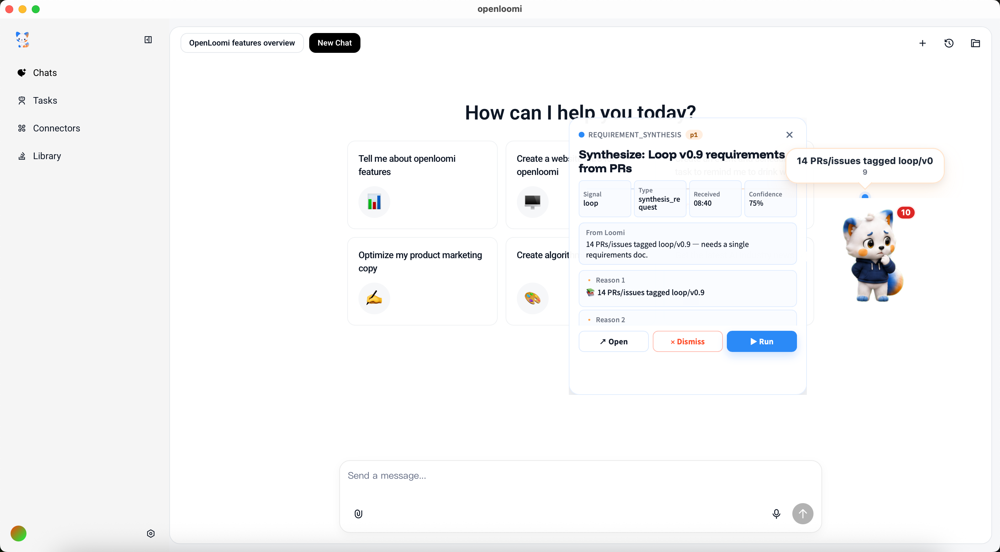


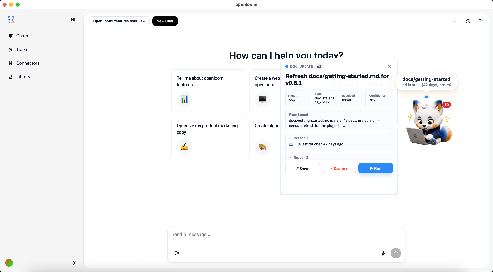

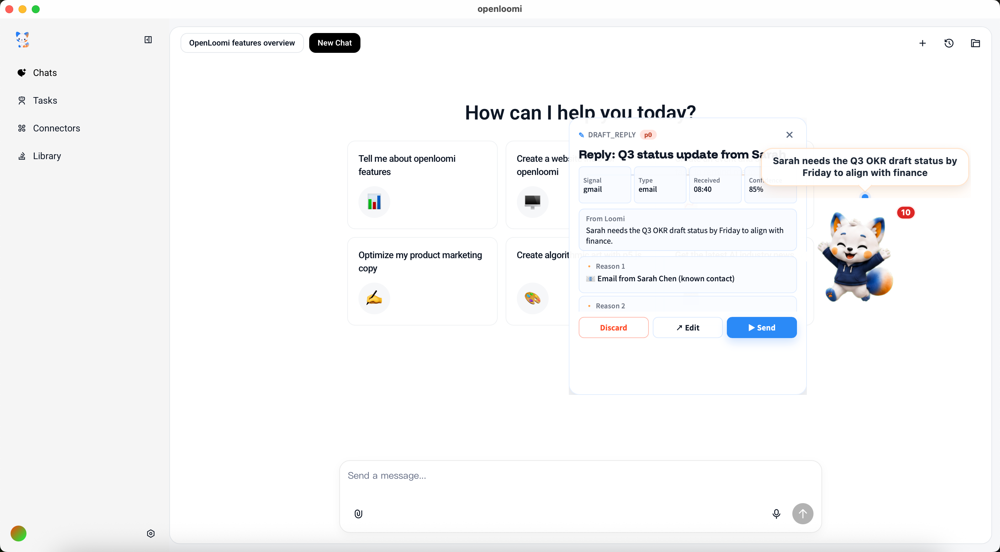


### 15b. From the card — Dry run / Edit / Run / Dismiss

The action row at the bottom of every card turns a recommendation into a real
outcome. The exact buttons depend on the card type:

- **`RSVP`** (calendar invitation): **Attend** (primary) · **Decline** (outline) ·
  **View original** (ghost). Tap Attend or Decline and OpenLoomi fires your
  `Yes` / `No` straight back through the connected Google Calendar as a
  `calendar_rsvp` action — no opening the event yourself to click the RSVP
  buttons.
- **Reply / update cards** (`IM_REPLY`, `EMAIL_REPLY`, `REVIEW_PR`,
  `LINEAR_REVIEW`, `REQUIREMENT_SYNTHESIS`, `RELEASE_PLAN`, `CONTACT_UPDATE`,
  `DOC_UPDATE`, `DEADLINE_REMINDER`, `TODO`): **Dry run** (outline) · **Edit**
  · **Run** (primary when ready) · **Dismiss** (ghost). `Dry run` previews
  the exact draft or plan without firing; `Run` schedules the action through
  the right connector — `email_reply` via Gmail, `im_reply` via Slack /
  iMessage, `github_review` via the GitHub Reviews API, `linear_review` via
  Linear, `requirement_synthesis` / `release_plan` / `doc_update` into the
  local knowledge base, `contact_update` into memory, `todo` into the local
  todo store.
- **Quiet digests** (`DIGEST` / `QUIET_DIGEST` / `github_notification`):
  **Mark as read** only — read-only aggregations, nothing to execute.

Two affordances live outside the action row so they never collide with the
decision itself:

- **Card-level Dismiss** sits in the header kebab (three-dot menu).
  Dismissing a card never accidentally declines a meeting. A mute rule is
  created for that signal scope, so the same hint won't resurface today.
- **Cancel scheduled action** appears for ~30 s after you tap Run / Attend /
  Decline. The action is queued as a cron job before it actually fires —
  `Cancel` stops it. A per-card audit history (under the technical details)
  records every attempt with its terminal state (`completed` / `skipped` /
  `blocked` / `failed` / `cancelled` / `superseded`), so contradictory
  responses (e.g. RSVP "No" then "Yes") appear side-by-side instead of
  overwriting each other.

If the underlying connector refuses (the runner returns `blocked` or
`failed`), the action row stays open with a one-tap retry — the card never
silently flips to `done` when nothing actually happened.

## 16. Register your own decision types

The Loop ships with the decision types above out of the box. You can register
your own — the contract is just a `PUT /api/loop/types` against the local
runtime. From a Bash block in Claude Code:

```bash
TOKEN=$(cat ~/.openloomi/token | base64 -d)
curl -s -X PUT -H "Authorization: Bearer $TOKEN" -H "Content-Type: application/json" \
  http://localhost:3414/api/loop/types \
  -d '{
    "id": "mom_imessage_alert",
    "label": "Mom iMessage",
    "icon": "👩",
    "actionKind": "todo",
    "description": "Triggers when mom sends an iMessage — surfaces as a high-priority todo so you never miss her"
  }'
```

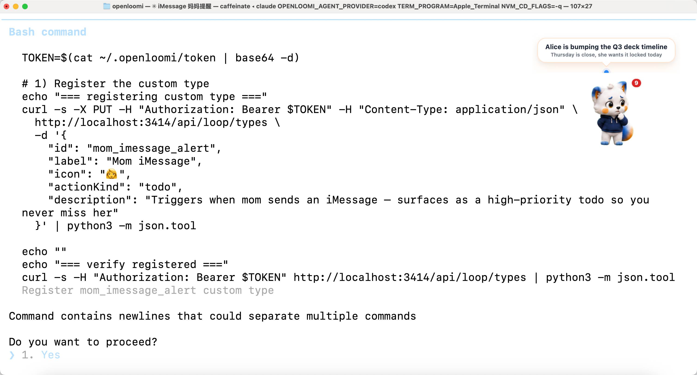

## 17. The custom type fires on the next signal

When the next matching signal arrives, your custom card appears in the
desktop app with the icon and label you registered, the `iMessage` signal +
type metadata, and the standard action row.


---

That's the full flow. Claude Code stays the surface you already know;
OpenLoomi becomes the memory, the connector layer, the proactive brain, and
the always-on desktop pet.
