# OpenLoomi × Codex CLI — End-to-End Tour Guide

This is the canonical, end-to-end walkthrough for the OpenLoomi Codex CLI
plugin. Every step is a single Codex turn or a single desktop-app
interaction; every screenshot is from a real run.

The full path: **install the plugin → land in a ready Codex session → see
the Loomi Pet pop on the desktop → flip the pet theme → call the
`openloomi` skill for the canonical JSON → use the bundled Codex hooks →
connect external apps via Composio → and finally watch OpenLoomi's Loop
surface decision cards in the desktop app** — all driven by prompts you
typed in Codex.

If you only want the commands, the [README](./README.md) is enough. This
document is for when you want to see _what the system actually looks like_
in motion.

---

## 1. Ask Codex to install the plugin

```text
> Install the plugin and setup https://github.com/melandlabs/openloomi/tree/main/plugins/codex
```

## 2. Add the marketplace

```text
> codex plugin marketplace add melandlabs/openloomi
```

Codex prompts for a source. Enter `melandlabs/openloomi` — it refreshes
the marketplace cache and you now see the `openloomi` plugin in the
marketplace list.

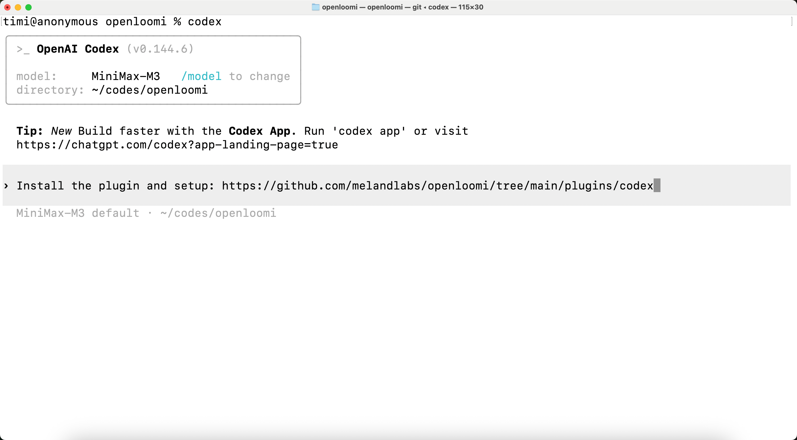

## 3. Launch Codex pointing at the local plugin

For plugin contributors (or anyone running from a checkout):

```text
% codex --plugin-dir plugins/codex
```

The plugin is now loaded into the session; you can confirm by typing
`@OpenLoomi` and seeing the skill resolve.

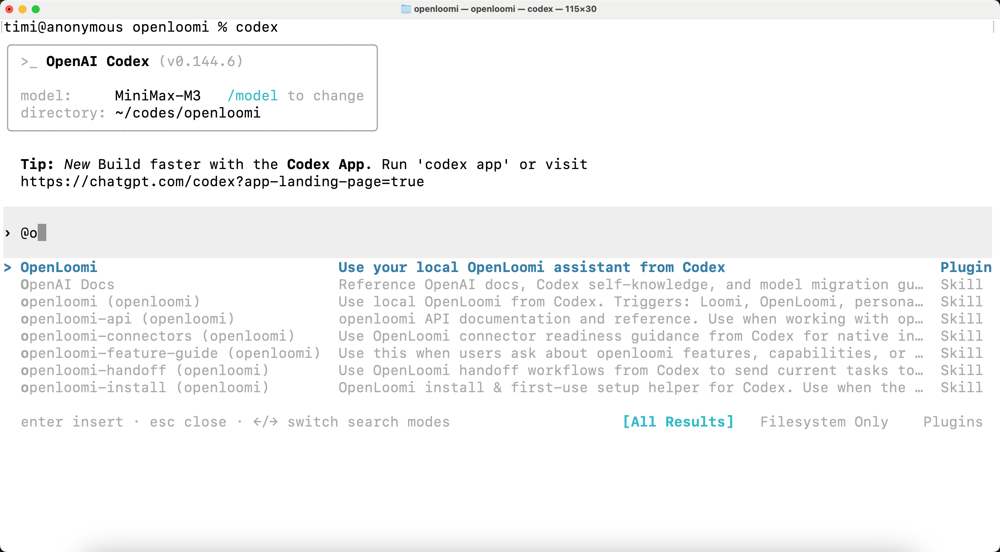

## 4. Discover the skills

Type `@OpenLoomi` — Codex surfaces the skill namespace. The thin
`openloomi` skill is the entry point, with sub-skills for
`openloomi-install` (install / configure the desktop), `openloomi-pet`
(pet state & themes), `openloomi-memory` (memory), `openloomi-loop`
(loop dashboard), `openloomi-connectors` (native connectors), and
`openloomi-handoff` (hand work off to the loop).

- `@OpenLoomi` — read-only doorway into the local runtime
- `@OpenLoomi install` — install / launch / configure the desktop app
- `@OpenLoomi status` — stable JSON status
- `@OpenLoomi pet <state>` — set the Loomi Pet state
- `@OpenLoomi memory` / `@OpenLoomi memory <query>` — local memory
- `@OpenLoomi loop` — Loop dashboard snapshot
- `@OpenLoomi handoff` — send a task to Loomi for follow-up


## 5. Run `@OpenLoomi install` — readiness table + fox Pet appears

The install skill auto-chains install → launch → wait API → guest login.
When it finishes, the bridge prints a small readiness table on the
**left**, and the Loomi Pet pops onto your desktop in the **fox** theme
on the **right** with a `Loomi is on watch` badge.

The pet is the file-watcher-driven widget — it doesn't talk to the
bridge; it watches `~/.openloomi/pet-config.json` and the
`assets/{fox,capybara}/` folders.

| Item               | Status     |
| ------------------ | ---------- |
| Guest login        | Successful |
| Runtime mode       | packaged   |
| Version            | 0.8.2      |
| Local API          | Reachable  |
| Execution provider | Ready      |
| Desktop process    | Running    |
| Final status       | **READY**  |

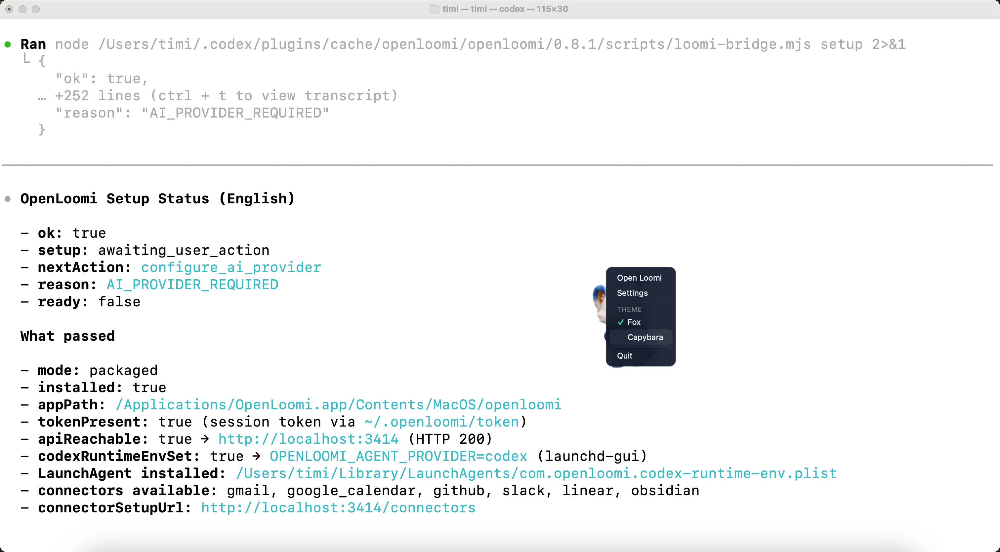

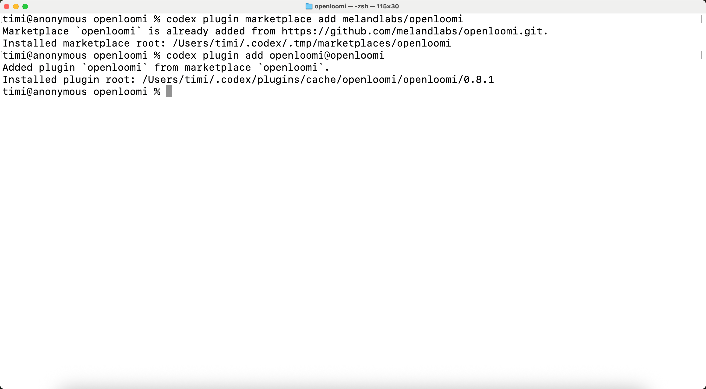

### 5b. If the Pet looks lost — read the `reason`

When a runtime dependency is missing the setup block surfaces a
`reason` such as `AI_PROVIDER_REQUIRED` and the Pet swaps to a
wondering pose. The red callout below shows the exact field to look
at — `reason` plus `nextAction` (here `configure_ai_provider`) tells
you which env variable or connector to set up next.


## 6. Right-click the Pet to open the context menu

The pet's context menu exposes **Open Loomi / Settings / THEME (Fox ✓,
Capybara) / Quit**. The theme switch is hot-reload — the file watcher
picks up `activeTheme` in `pet-config.json` within ~250 ms, and the
bridge never writes these files.

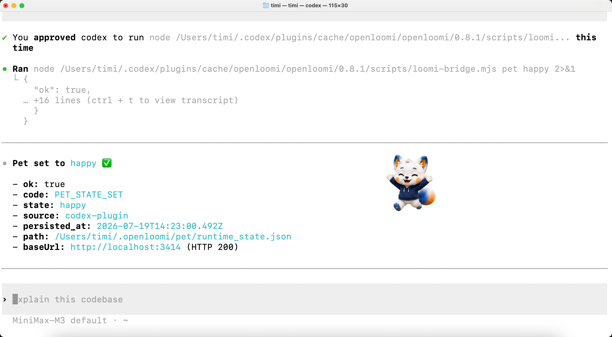

## 7. Pick **Capybara** — the theme hot-reloads immediately

The pet re-skins in place. Same 9-state vocabulary (`happy` / `idle` /
`juggling` / `needsinput` / `presenting` / `sleeping` / `sweeping` /
`thinking` / `working`) — only the artwork changes.

### 7c. Drop in your own theme — `kawaii` cat via `pet-custom/`

The built-in themes are Fox and Capybara, but the pet watcher also
auto-discovers any folder under `~/.openloomi/pet-custom/<name>/` with
PNG state sprites. Drop a folder in, and the theme appears in the
right-click menu within ~250 ms — no bridge call, no restart. Below, a
`kawaii` cat pack is installed and active: the small sprite in the
top-left of the desktop app swaps to the kawaii cat, and the inline
chat pet (shown `thinking` with a thought bubble while a tool call is
in flight) renders from the same pack.


### 7b. Manually override the Pet state from Codex

The hot-reload pet also accepts manual overrides from Codex. Have
Codex call the bridge directly:

```text
> @OpenLoomi pet happy
```

or, equivalently:

```bash
node "${CODEX_PLUGIN_ROOT:-plugins/codex}/scripts/loomi-bridge.mjs" pet happy
```

The bridge writes the new state to
`~/.openloomi/pet/runtime_state.json`; the file watcher picks it up and
the sprite swaps within ~250 ms. Useful for "task done" beats where you
want the pet to flip to `happy` between turns.

## 8. `@OpenLoomi status` returns the canonical JSON

For any triage / bug report, paste the JSON output verbatim. The shape
is stable: `mode / installed / version / tokenPresent /
nativeRuntime / apiReachable / hooksInstalled /
ready / nextAction / reason / source`

## 9. Codex hooks — bundled by default, no install step

Unlike the Claude plugin (where `/openloomi:hooks install` is opt-in),
the Codex plugin declares its lifecycle hooks in
`plugins/codex/hooks/hooks.json` and they are bundled into every
session automatically. The full event surface Codex maps to pet
states:

| Codex event         | Pet state set |
| ------------------- | ------------- |
| `SessionStart`      | `presenting`  |
| `UserPromptSubmit`  | `thinking`    |
| `PreToolUse`        | `working`     |
| `PermissionRequest` | `needsinput`  |
| `PostToolUse`       | `thinking`    |
| `SubagentStart`     | `juggling`    |
| `SubagentStop`      | `thinking`    |
| `Stop`              | `happy`       |

Each handler is a thin `node .../scripts/loomi-bridge.mjs state <name>
--event <event> --quiet` call with a 5s timeout. The bridge never
blocks the Codex turn; if the runtime API is unreachable it logs a
single line and exits 0.

## 10. Hooks status — confirm install

The Codex plugin's hooks are always-on, so the equivalent of "hooks
status" is just `@OpenLoomi status` — the JSON reports
`hooksInstalled: true` and `source: "codex-plugin"` whenever the
`hooks/hooks.json` block is present in the loaded plugin.

You should see:

- `hooksInstalled: true`
- Plugin path: `plugins/codex/hooks/hooks.json`
- `source: "codex-plugin"`
- `nativeRuntime: codex` (when OpenLoomi is configured to use Codex as
  its agent executor)

If `hooksInstalled` is `false`, check that you launched Codex with
`--plugin-dir plugins/codex` (or that the marketplace-installed copy
shipped the `hooks/` directory).

## 11. `@OpenLoomi handoff` — composio + screen memory + connector

The handoff skill walks you through three independent questions:
install the `composio` skill, enable Screen Memory (`Preferences →
Chronicle → Screen Memory` in the desktop app), and connect a
messaging connector (`openloomi-connectors` skill — native 7
platforms; or composio for the broader 1000+).

The screenshot below shows the connector step in the middle of the
wizard.

## 12. After Composio connects — 6 active apps

The next Codex turn can list what the user is actually wired up to. In
this run: Gmail, Google Calendar, Google Drive, GitHub, Linear, Slack
— all through Composio, with the workspace org and test user echoed
back.

```text
Connected via Composio (6 active): Gmail, Google Calendar, Google Drive, GitHub, Linear, Slack
Org: timi_workspace · Test user: pg-test-…
```

From this point on, Codex is a thin UI on top of OpenLoomi. Anything
that happens in your connected apps — emails, PRs, calendar RSVPs,
Linear issues, Slack messages — gets pulled into OpenLoomi's memory
and (if you opt in) into its proactive Loop.

## 13. `@OpenLoomi memory` — see what's already in your local memory

```text
> @OpenLoomi memory
```

The skill searches the local memory + knowledge base + insights and
returns a digest of what OpenLoomi already knows. In this run, the
digest includes:

- A **"From Loomi" callout** at the top: "Sarah's signature says 'Head
  of Product' — memory still says PM" — the same drift that the Loop
  is about to surface as a `CONTACT_UPDATE` card.
- A **"Last 7 days (50 insights total)" table** with columns `# / Time
(UTC) / Type / Importance / Title` — auto-captured Codex session
  snapshots, Screen Memory captures, and the occasional archive note.
- **Notes** at the bottom explaining the mix (e.g. "duplicated
  sessions — two ingestion channels writing the same session", "two
  oldest sessions reference loop tick / Loomi card / 继续切 decision
  — carry-over from prior work before today's `@OpenLoomi install`
  finished wiring up").

This is the read-only doorway into OpenLoomi's local memory. For a
deeper search, pass a query: `@OpenLoomi memory <query>`.

### 13b. Write to memory from Codex with `add-memory`

Reading is half the story — you can also write. From any Codex turn,
invoke `openloomi-memory add-memory "<text>" --file=<path>` and the
entry lands in `~/.openloomi/data/memory/<path>`. Below, "My boss is
Tom." is saved to `people/boss.md` and immediately searchable via
`search-memory "boss"` or `search-all "boss tom"`.

## 14. `@OpenLoomi loop` — see the Loop dashboard snapshot

```text
> @OpenLoomi loop
```

The command hits `GET /api/loop/state` and returns the Loop dashboard:

- **Header**: `enabled: true`, last tick timestamp.
- **Counts**: pending decisions, done, dismissed, signals seen (with
  unsupported count).
- **Connector health**: per-connector status (`needs_setup` /
  `local-only` / linked) for every platform the Loop can pull from.
- **Prefs in effect**: tick frequency, brief time, wrap time,
  quiet-when-empty, desktop notifications, promotion/no-reply skip,
  narrative mode.
- **Notes**: actionable observations — e.g. "all 5 Composio-backed
  connectors share one failure: the local Composio surface isn't
  reachable. Loop can't pull signals or generate decisions from
  Gmail/Calendar/GitHub/Slack/Linear until `@OpenLoomi handoff` walks
  the Composio install."

This is purely a dashboard snapshot — the Loop never takes
destructive actions from this command. For actions, the Loop pops
cards in the desktop app (see step 15) and you decide there.

## 15. The Loop surfaces decision cards in OpenLoomi Desktop

This is what the system looks like when it's actually doing its job.
OpenLoomi's **Loop** is the proactive execution brain — it watches
your connected signals, classifies them into one of the decision
types, and pops a card into the desktop app with the `From Loomi`
reasoning trace and the action buttons you can hit.

Each card has the same shape: a `Signal` + `Type` + `Received` +
`Confidence` row at the top, the `From Loomi` explanation next, the
`Reason 1 / Reason 2` evidence trace, and the action buttons at the
bottom.

| Decision type           | What it does                                | Example                                                                                |
| ----------------------- | ------------------------------------------- | -------------------------------------------------------------------------------------- |
| `RSVP`                  | Reply Yes / No to a calendar invitation     | "Reverb Q3 review — Wed 10:00 PT, organizer Sarah, conflicts with standup"             |
| `IM_REPLY`              | Draft a reply to a known contact            | "Alice is bumping the Q3 deck timeline — Thursday is close, she wants it locked today" |
| `EMAIL_REPLY`           | Pre-draft an outbound email                 | "Sarah needs the Q3 OKR draft status by Friday to align with finance"                  |
| `LINEAR_REVIEW`         | Triage a Linear issue assigned to you       | "LIN-1234 (pet bubble drag-and-drop) is in In Review with you assigned"                |
| `REQUIREMENT_SYNTHESIS` | Cluster PRs/issues into a requirements doc  | "14 PRs/issues tagged loop/v0.9 — needs a single requirements doc"                     |
| `RELEASE_PLAN`          | Draft a release plan from merged PRs        | "12 PRs merged since v0.8.2 — time to draft the v0.8.2 release plan"                   |
| `CONTACT_UPDATE`        | Update a contact record when memory drifts  | "Sarah's signature says 'Head of Product' — memory still says PM"                      |
| `DOC_UPDATE`            | Refresh a stale doc for the next version    | "docs/getting-started.md is stale (42 days, pre-v0.8.2)"                               |
| `REVIEW_PR`             | Surface a PR waiting on your review         | "PR #220 (lifestyle image prompts) is waiting on your review"                          |
| `DEADLINE_REMINDER`     | Surface an upcoming due date                | "v0.8.2 release plan due Friday — 3 PRs blocking the cut"                              |
| `TODO`                  | Add a follow-up to your todo list           | "Bug: historical self-owned calendar events surface as fake RSVP decisions"            |
| `DIGEST` (QUIET)        | Consolidate a flood of low-priority signals | "8 GitHub notifications — none urgent individually, but here's the consolidated view"  |

A few of the cards in detail:


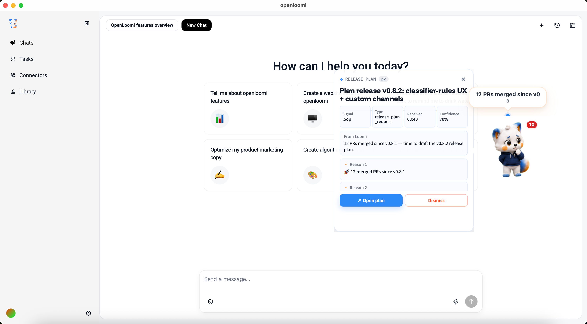

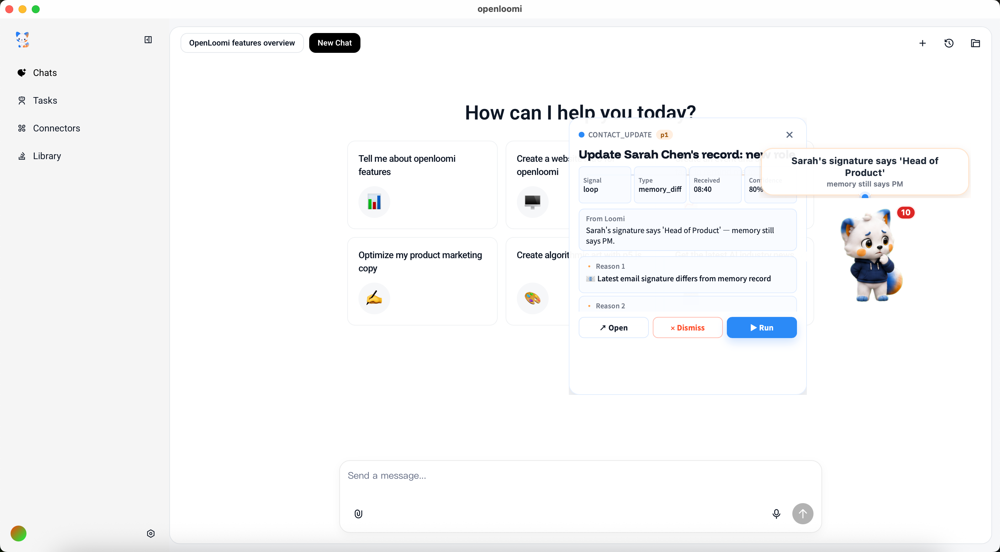


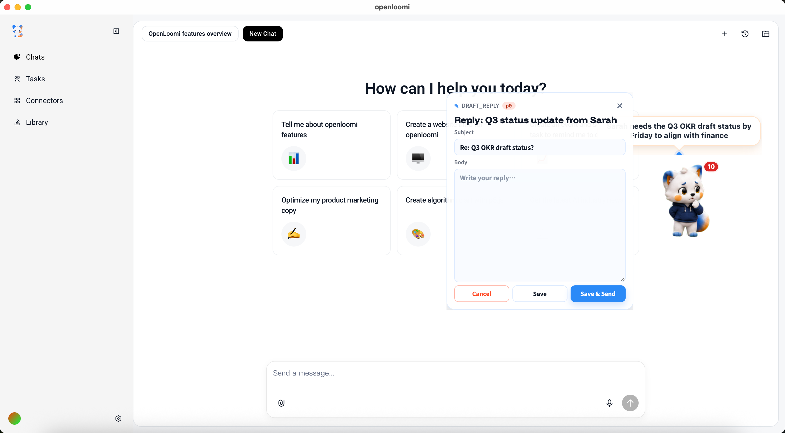

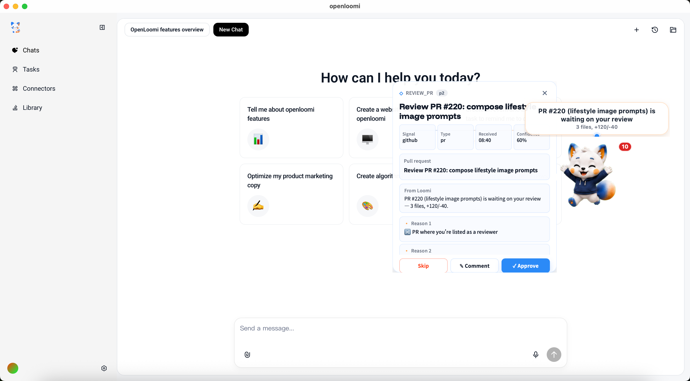

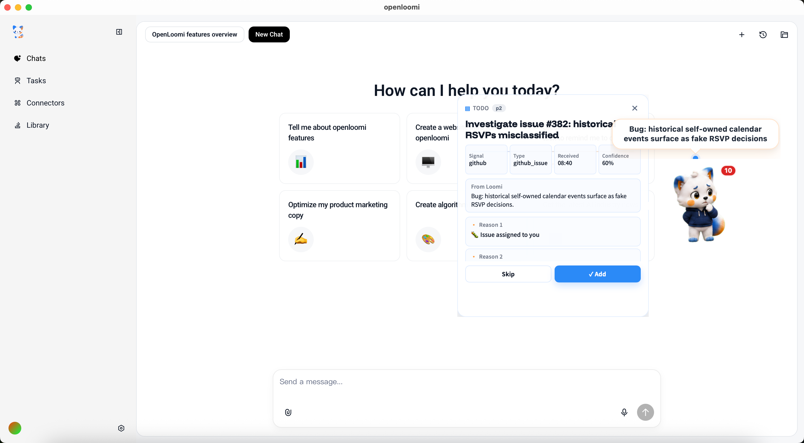

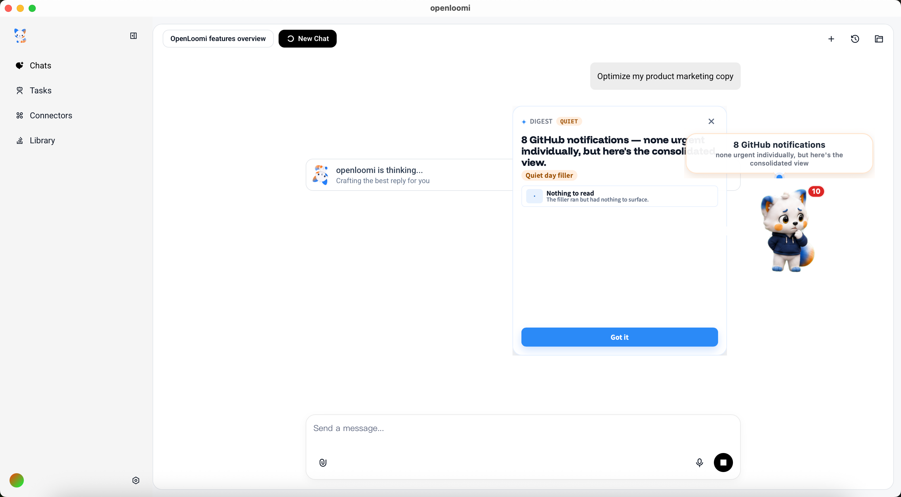

### 15b. From the card — Dry run / Edit / Run / Dismiss

The action row at the bottom of every card turns a recommendation into
a real outcome. The exact buttons depend on the card type:

- **`RSVP`** (calendar invitation): **Attend** (primary) · **Decline**
  (outline) · **View original** (ghost). Tap Attend or Decline and
  OpenLoomi fires your `Yes` / `No` straight back through the connected
  Google Calendar as a `calendar_rsvp` action — no opening the event
  yourself to click the RSVP buttons.
- **Reply / update cards** (`IM_REPLY`, `EMAIL_REPLY`, `REVIEW_PR`,
  `LINEAR_REVIEW`, `REQUIREMENT_SYNTHESIS`, `RELEASE_PLAN`,
  `CONTACT_UPDATE`, `DOC_UPDATE`, `DEADLINE_REMINDER`, `TODO`):
  **Dry run** (outline) · **Edit** · **Run** (primary when ready) ·
  **Dismiss** (ghost). `Dry run` previews the exact draft or plan
  without firing; `Run` schedules the action through the right
  connector — `email_reply` via Gmail, `im_reply` via Slack /
  iMessage, `github_review` via the GitHub Reviews API,
  `linear_review` via Linear, `requirement_synthesis` /
  `release_plan` / `doc_update` into the local knowledge base,
  `contact_update` into memory, `todo` into the local todo store.
- **Quiet digests** (`DIGEST` / `QUIET_DIGEST` /
  `github_notification`): **Mark as read** only — read-only
  aggregations, nothing to execute.

Two affordances live outside the action row so they never collide
with the decision itself:

- **Card-level Dismiss** sits in the header kebab (three-dot menu).
  Dismissing a card never accidentally declines a meeting. A mute
  rule is created for that signal scope, so the same hint won't
  resurface today.
- **Cancel scheduled action** appears for ~30 s after you tap Run /
  Attend / Decline. The action is queued as a cron job before it
  actually fires — `Cancel` stops it. A per-card audit history
  (under the technical details) records every attempt with its
  terminal state (`completed` / `skipped` / `blocked` / `failed` /
  `cancelled` / `superseded`), so contradictory responses (e.g. RSVP
  "No" then "Yes") appear side-by-side instead of overwriting each
  other.

If the underlying connector refuses (the runner returns `blocked` or
`failed`), the action row stays open with a one-tap retry — the card
never silently flips to `done` when nothing actually happened.

## 16. Register your own decision types

The Loop ships with the decision types above out of the box. You can
register your own — the contract is just a `PUT /api/loop/types`
against the local runtime. From a Bash block in Codex:

```bash
TOKEN=$(cat ~/.openloomi/token | base64 -d)
curl -s -X PUT -H "Authorization: Bearer $TOKEN" -H "Content-Type: application/json" \
  http://localhost:3414/api/loop/types \
  -d '{
    "id": "mom_imessage_alert",
    "label": "Mom iMessage",
    "icon": "👩",
    "actionKind": "todo",
    "description": "Triggers when mom sends an iMessage — surfaces as a high-priority todo so you never miss her"
  }'
```

## 17. The custom type fires on the next signal

When the next matching signal arrives, your custom card appears in
the desktop app with the icon and label you registered, the
`iMessage` signal + type metadata, and the standard action row.

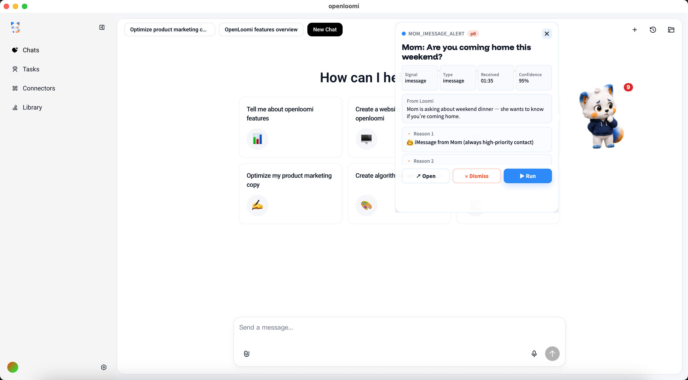

---

That's the full flow. Codex stays the surface you already know;
OpenLoomi becomes the memory, the connector layer, the proactive
brain, and the always-on desktop pet.
